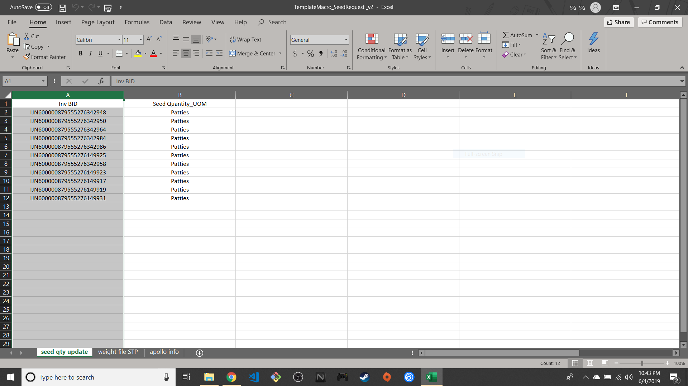
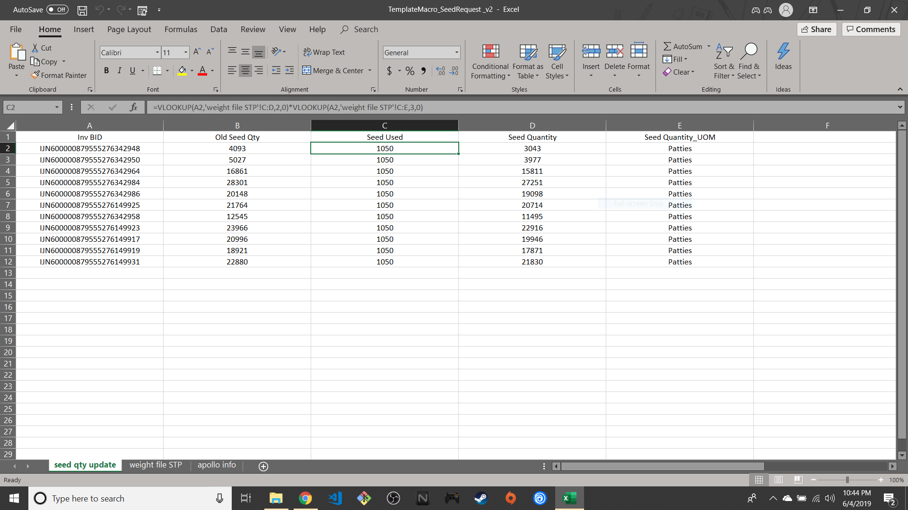
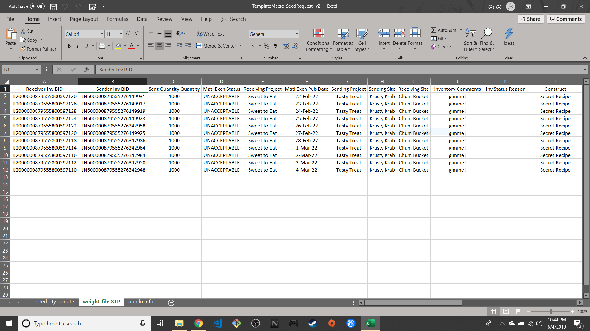
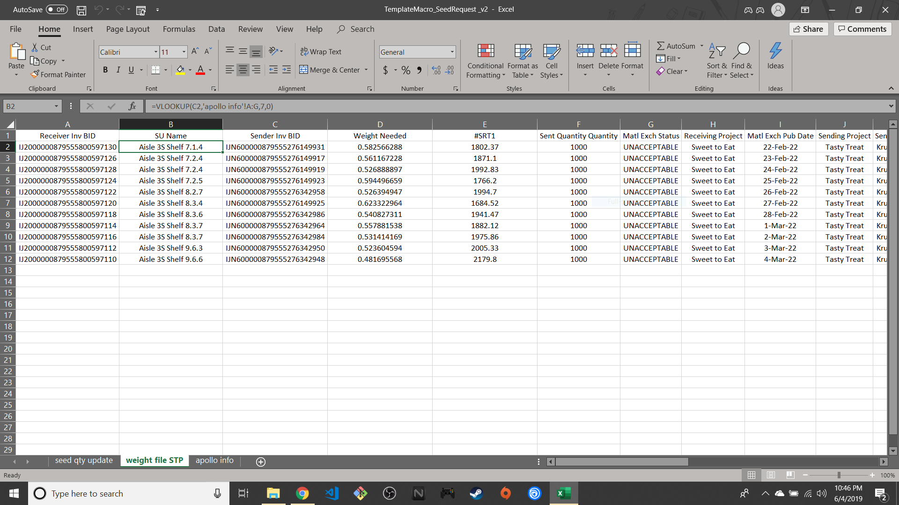

This repository features a project that was originally a part of a different repository, which featured both "TemplateMacro" and "ShelfCheck". Both projects were completed in May of 2019, but were separated into two distinct repos as a part of a GitHub refactoring in June 2020.

    
# TemplateMacro_v2

- The purpose of this macro is to automate the populating of sheets and cells with the appropriate values, this was typically achieved by manually inputting names and formulas into the sheets/cells. The macro will automatically provide the user with the necessary sheets, cells, and formulas (ranging from basic equations to operations featuring multiple vlookups).

     *The macro requires some baseline information, because the baseline information changes upon every use it must still be manually input by the user. Said information includes an "apollo info" worksheet with all apollo info columns and values, and inventory ids within worksheets with the names "seed qty update" and "weight info STP".
      
     *The macro will detect if one of the three necessary worksheets are missing, or if one of the necessary inventory id columns are missing. In such a case, the macro will create the needed worksheets as to ensure they are of the proper name and inform the the user that certain columns are missing.
     
# BEFORE ("seed qty update") SHEET

# AFTER ("seed qty update") SHEET

# BEFORE ("weight file STP") SHEET

# AFTER ("weight file STP") SHEET

## HOW TO USE THE MACRO

### WARNING 
__Once macros are run, Excel does not allow reverting any changes made to worksheets.__                         

- Click on TemplateMacro "xlsm" file within this repo.
- Find and click the "Download" button for the "xlsm" file.
- Open the Excel file and enable editing and macros, when prompted.
- Locate the "customize quick access toolbar" on the upper left-hand corner of the Excel window
- Click the "customize quick access toolbar" button and select "More commands..."
- Scroll down the large leftward selection box until finding the "View Macros" icon.
- Add the "View Macros" icon to rightward selection box by clicking it then pressing "Add".
- Once the button is added, select "Ok" at the bottom of the customization window.
- Click the newly added "View Macros" icon located near the "customize quick access toolbar" button.
- Select the macro "SR_Template".
        

Unless using SR_Template for work, in which case, you can replace the following information:
Do not remove nor move any inv_bid columns found on worksheets and do not alter "apollo info" worksheet.
All demos need the default sheets/columns.
                      
Once finished using the SR_Template macro, close the Excel file without saving or save to a new Excel file.               
Otherwise, a second demo would require re-downloading the file or resetting the worksheets manually.

